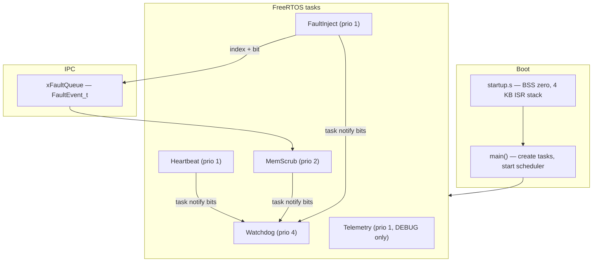

# space-baremetal-skeleton

Minimal bare-metal firmware skeleton for **RISC-V (rv64)**, built with **FreeRTOS** and tuned for **space / aerospace** thinking: dependability, radiation-aware memory handling, and observable runtime behavior.

Runs on QEMU `virt` with no BIOS — UART console only.

## Goals

This skeleton explores core ideas from dependability and computer architecture:

- **FDIR** (Fault Detection, Isolation, Recovery): software watchdog, SEU injection, and memory scrub
- **Radiation-aware memory**: golden-copy EDAC simulation with targeted bit correction
- **Determinism & observability**: fixed-priority tasks, bounded queues, DEBUG telemetry with stack high-water marks
- **Resource discipline**: separate ISR stack, heap-budgeted task stacks, boot-time failure checks

## Architecture



### Memory layout

| Region | Location | Size | Purpose |
|--------|----------|------|---------|
| ISR / trap stack | Static `.bss` in `startup.s` | 4 KB | Machine-mode traps, pre-scheduler boot |
| Task stacks | FreeRTOS heap (`heap_4`) | Per-task | Application task context |
| FreeRTOS heap | `ucHeap` | 32 KB | TCBs, stacks, fault queue, timer task |
| Scrub buffers | Static `.bss` | 512 B × 2 | `scrub_area` + `golden_copy` |

Task stack depths and priorities live in `include/system_defs.h`.

## Application tasks

| Task | Priority | Period | Role |
|------|----------|--------|------|
| **Watchdog** | 4 | — | Waits for notification bits from all monitored tasks; halts on timeout (3.5 s) |
| **MemScrub** | 2 | 800 ms | Background full-array scrub, or **targeted bit fix** on fault events |
| **Heartbeat** | 1 | 1 s | Liveness indicator + watchdog kick |
| **FaultInject** | 1 | 3 s | Flips a random bit in `scrub_area`, queues `FaultEvent_t` to MemScrub |
| **Telemetry** | 1 | 15 s | DEBUG-only snapshot: uptime, heap, ISR stack guard, task stack HWM |

Kernel tasks (**Idle**, **TmrSvc**) are included in DEBUG telemetry stack reporting.

### Watchdog

Each monitored task kicks the watchdog via `xTaskNotify` with a dedicated bit (`WATCHDOG_BIT_*` in `system_defs.h`). The watchdog blocks until all expected bits arrive within `WATCHDOG_TIMEOUT_MS` (3500 ms — longer than the 3 s fault-inject period).

### Memory scrub & fault injection

1. **FaultInject** corrupts one bit: `scrub_area[idx] ^= (1 << bit)`
2. It posts `{ index, bit }` on `xFaultQueue` (depth 5)
3. **MemScrub** drains the queue and calls `memory_scrub_fix_event()` — compares only that bit against `golden_copy` and restores it without scanning the full array
4. On cycles with no queued events, MemScrub runs a periodic full-array background scrub

### DEBUG telemetry

Build with `make debug` to enable:

- **Telemetry task** — periodic UART snapshot under a critical section (no interleaved logs)
- **ISR stack guard** — paints `stack_low` with `0xDEADBEEF`, checks for overflow into the guard region

Example output:

```
=== telemetry ===
uptime_s=15
heap: free=17520 min_ever=17520
isr_stack: ok hwm_bytes=0
task stacks HWM (words):
  Watchdog: alloc=256 free=207 peak=49
  Heartbeat: alloc=256 free=219 peak=37
  MemScrub: alloc=384 free=341 peak=43
  FaultInject: alloc=256 free=211 peak=45
  Telemetry: alloc=256 free=209 peak=47
  Idle: alloc=128 free=85 peak=43
  TmrSvc: alloc=128 free=81 peak=47
=================
```

On rv64, multiply word counts by 8 for bytes. Use `peak` values (plus margin) to right-size stacks before shrinking allocations.

## Project layout

```
include/
  system_defs.h    # FaultEvent_t, watchdog bits, task priorities & stack sizes
  FreeRTOSConfig.h # Kernel config (32 KB heap, stack overflow check method 2)
  common.h         # Shared includes for application code
src/
  startup.s          # Reset vector, BSS init, ISR stack
  main.c             # Task creation, scheduler start
  watchdog.c         # Notification-based watchdog task
  memory_scrub.c     # Golden-copy scrub + targeted event fix
  fault_inject.c     # SEU simulation
  fault_queue.c      # FreeRTOS queue between inject and scrub
  telemetry.c        # DEBUG periodic reporter
  isr_stack_guard.c  # DEBUG ISR stack paint/check
  uart.c             # MMIO UART (QEMU virt console)
FreeRTOS/            # Vendored FreeRTOS sources (RISC-V GCC port, heap_4)
linker.ld            # Loads at 0x80000000 (QEMU kernel region)
```

## Build & run

### Prerequisites

```bash
# Ubuntu/Debian
sudo apt install gcc-riscv64-unknown-elf qemu-system-misc
```

### Release build (production tasks only)

```bash
make clean
make
make qemu
```

### DEBUG build (telemetry + ISR stack guard)

```bash
make clean
make debug
make qemu
```

Or equivalently: `make clean && DEBUG=1 make && make qemu`

### Error handling

Boot checks `fault_queue_init()` and every `xTaskCreate()`. Failures call `system_halt()` and print a message on UART — the system does not start with a partially initialized task set.

## Configuration highlights

| Setting | Value | Notes |
|---------|-------|-------|
| `configCPU_CLOCK_HZ` | 10 MHz | Matches QEMU virt `mtime` |
| `configTOTAL_HEAP_SIZE` | 32 KB | Task stacks + idle + timer + fault queue |
| `configCHECK_FOR_STACK_OVERFLOW` | 2 | Canary check on context switch |
| `INCLUDE_uxTaskGetStackHighWaterMark` | 1 | Used by DEBUG telemetry |

## QEMU command

The Makefile runs:

```bash
qemu-system-riscv64 -machine virt -cpu rv64 -nographic -kernel kernel.bin -bios none
```

## License

See [LICENSE](LICENSE).