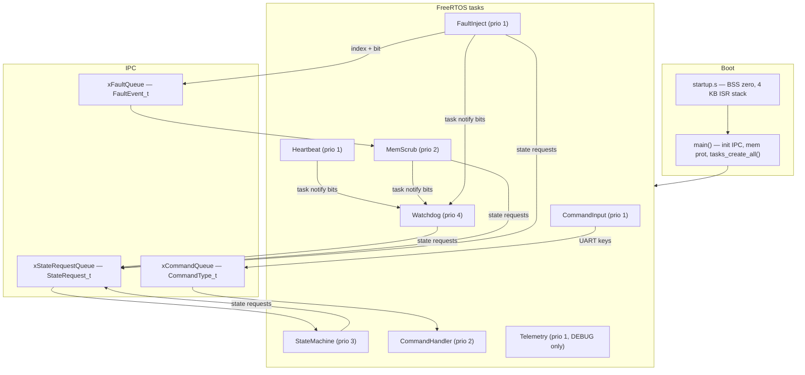

# space-baremetal-skeleton

[](https://github.com/fer90/space-baremetal-skeleton/actions/workflows/ci.yml)

Minimal bare-metal firmware skeleton for **RISC-V (rv64)**, built with **FreeRTOS** and tuned for **space / aerospace** thinking: dependability, radiation-aware memory handling, and observable runtime behavior.

Runs on QEMU `virt` with no BIOS — UART console only.

## Goals

This skeleton explores core ideas from dependability and computer architecture:

- **FDIR** (Fault Detection, Isolation, Recovery): software watchdog, SEU injection, memory scrub, and a graded system-state machine
- **Radiation-aware memory**: immutable golden copy in `.rodata`, mutable scrub buffer with targeted bit correction
- **Software memory protection**: instrumented read/write/exec checks with violation counting
- **Determinism & observability**: fixed-priority tasks, bounded queues, prefixed UART logging, DEBUG telemetry with stack high-water marks
- **Resource discipline**: separate ISR stack, heap-budgeted task stacks, boot-time failure checks

## Architecture



### Memory layout

| Region | Location | Size | Purpose |
|--------|----------|------|---------|
| ISR / trap stack | Static `.bss` in `startup.s` | 4 KB | Machine-mode traps, pre-scheduler boot |
| Task stacks | FreeRTOS heap (`heap_4`) | Per-task | Application task context |
| FreeRTOS heap | `ucHeap` | 32 KB | TCBs, stacks, queues, timer task |
| `golden_copy` | Static `.rodata` | 512 B | Immutable reference pattern (`0..255` × 2) |
| `scrub_area` | Static `.bss` | 512 B | Mutable buffer under software MPU |

Task stack depths and priorities live in `include/system_defs.h`. All application tasks are declared in a single `task_configs[]` table in `src/tasks.c`.

## Application tasks

| Task | Priority | Period | Role |
|------|----------|--------|------|
| **Watchdog** | 4 | 3.5 s window | Collects notification bits from monitored tasks; escalates state on timeout; recovers to NOMINAL after 5 good cycles in DEGRADED |
| **StateMachine** | 3 | event-driven | Applies state transitions from `xStateRequestQueue` (monotonic: only equal or higher states) |
| **MemScrub** | 2 | 800 ms | Targeted bit fix on fault events, or full-array background scrub |
| **CommandHandler** | 2 | blocking | Executes UART commands dequeued from `xCommandQueue` |
| **Heartbeat** | 1 | 1 s | Liveness indicator + watchdog kick |
| **FaultInject** | 1 | 3 s | Periodic SEU simulation (toggleable); queues `FaultEvent_t` to MemScrub |
| **CommandInput** | 1 | 10 ms poll | Reads UART, dispatches single-key commands to the handler queue |
| **Telemetry** | 1 | 15 s | DEBUG-only periodic snapshot |

Kernel tasks (**Idle**, **TmrSvc**) are included in DEBUG telemetry stack reporting.

### System state machine

States: **BOOT** → **NOMINAL** → **DEGRADED** → **SAFE** (monotonic escalation via the state machine task).

| Trigger | New state | Reason code |
|---------|-----------|-------------|
| Boot init | BOOT → NOMINAL | (state machine startup) |
| Watchdog timeout (first) | DEGRADED | `0x01` |
| Watchdog timeout (already DEGRADED) | SAFE | `0x01` |
| 5 SEUs corrected (rolling window) | DEGRADED | `0x02` |
| 5 successful watchdog cycles in DEGRADED | NOMINAL | `0x03` |
| 3 memory-protection violations | DEGRADED | `0x04` |
| UART `n` / `d` / `a` | NOMINAL / DEGRADED / SAFE | `0x10` |
| Watchdog timeout (already SAFE) | (no further escalation) | `0x01` |

State changes are logged with the `[STATE]` prefix. Entering **SAFE** applies the survival policy described in [ARCHITECTURE.md](ARCHITECTURE.md#system-states-and-safe-policy) (`[SAFE]` log prefix).

### Watchdog

Each monitored task kicks the watchdog via `xTaskNotify` with a dedicated bit (`WATCHDOG_BIT_*` in `system_defs.h`). The watchdog blocks until all expected bits arrive within `WATCHDOG_TIMEOUT_MS` (3500 ms — longer than the 3 s fault-inject period).

The kick path runs through `watchdog_kick_impl()` in `.text.critical`; `watchdog_kick()` verifies exec permission before calling it.

### Memory scrub & fault injection

1. **FaultInject** corrupts one bit: `scrub_area[idx] ^= (1 << bit)`
2. It posts `{ index, bit }` on `xFaultQueue` (depth 5)
3. **MemScrub** drains the queue and calls `memory_scrub_fix_event()` — compares only that bit against `golden_copy` and restores it without scanning the full array
4. On cycles with no queued events, MemScrub runs a periodic full-array background scrub
5. Automatic injection can be disabled at runtime with the `x` UART command; manual `f` still works

### Software memory protection

A lightweight software MPU tracks protected regions and checks instrumented accesses:

- `memory_protection_check_access(addr, size, MEM_PERM_READ | WRITE | EXEC)`
- **ScrubArea** — read/write for `scrub_area`
- **CriticalText** — read/exec for `.text.critical` (watchdog kick implementation)

Violations are logged with `[VIOLATION]`, counted, and trigger DEGRADED at 3 hits. Scrub read/write paths and watchdog kicks go through the checker.

### UART commands

`CommandInput` polls the console; `CommandHandler` executes queued commands. In QEMU `-nographic`, type directly in the terminal (use **Ctrl+A** then **c** if you need to return to the QEMU monitor).

| Key | Action |
|-----|--------|
| `s` | Print DEBUG telemetry snapshot (`[TELEMETRY]` block) |
| `n` | Request NOMINAL state |
| `d` | Request DEGRADED state |
| `a` | Request SAFE state |
| `l` | Dump flight recorder log (`[REC]` entries) |
| `f` | Inject one fault immediately |
| `r` | Force a full memory scrub |
| `v` | Print memory-protection violation count |
| `u` | Print cumulative SEU count |
| `x` | Toggle automatic fault injection on/off |
| `h` | Show help (`?` also works) |

All command messages use the `[CMD]` prefix.

### Logging

UART output uses consistent prefixes defined in `include/log.h`:

| Prefix | Use |
|--------|-----|
| `[ERROR]` | Fatal halt, stack overflow, watchdog timeout, exceptions |
| `[STATE]` | System state announcements and transitions |
| `[VIOLATION]` | Memory-protection violations and blocked accesses |
| `[CMD]` | Command input, help, and command responses |
| `[REC]` | Flight recorder dump (`l` command) |
| `[TELEMETRY]` | DEBUG telemetry snapshot lines |

Fatal boot failures call `system_halt(reason)`:

```
[ERROR] System halted: xTaskCreate failed
```

### DEBUG telemetry

Build with `make debug` to enable:

- **Telemetry task** — periodic UART snapshot under a critical section (no interleaved logs)
- **ISR stack guard** — paints `stack_low` with `0xDEADBEEF`, checks for overflow into the guard region

Example output:

```
[TELEMETRY] === snapshot ===
[TELEMETRY] uptime_s=15
[TELEMETRY] heap: free=17520 min_ever=17520
[TELEMETRY] mem_prot: violations=0 regions=2
[TELEMETRY] isr_stack: ok hwm_bytes=0
[TELEMETRY] task stacks HWM (words):
[TELEMETRY]   Watchdog: alloc=256 free=207 peak=49
[TELEMETRY]   Heartbeat: alloc=256 free=219 peak=37
[TELEMETRY]   MemScrub: alloc=384 free=341 peak=43
[TELEMETRY]   FaultInject: alloc=256 free=211 peak=45
[TELEMETRY]   Telemetry: alloc=256 free=209 peak=47
[TELEMETRY]   Idle: alloc=128 free=85 peak=43
[TELEMETRY]   TmrSvc: alloc=128 free=81 peak=47
[TELEMETRY] ================
```

On rv64, multiply word counts by 8 for bytes. Use `peak` values (plus margin) to right-size stacks before shrinking allocations.

## Project layout

```
include/
  system_defs.h       # FaultEvent_t, watchdog bits, task priorities & stack sizes
  system_state.h      # SystemState_t, state request queue API
  memory_protection.h # Software MPU regions and access checks
  critical_exec.h     # CRITICAL_TEXT section attribute
  command.h           # UART command types and task declarations
  log.h               # UART log prefixes
  FreeRTOSConfig.h    # Kernel config (32 KB heap, stack overflow check method 2)
  common.h            # Shared includes for application code
src/
  startup.s           # Reset vector, BSS init, ISR stack
  main.c              # Boot init, scheduler start
  tasks.c             # task_configs[] table, tasks_create_all()
  watchdog.c          # Notification-based watchdog + recovery
  state_machine.c     # State transition task
  safe_policy.c       # SAFE-mode capability gating
  event_log.c         # Flight recorder ring buffer (UART l)
  system_state.c      # State request queue
  memory_scrub.c      # Scrub logic + scrub_area buffer
  golden_copy.c       # const golden reference in .rodata
  memory_protection.c # Software MPU implementation
  critical_exec.c     # Registers .text.critical with mem protection
  fault_inject.c      # SEU simulation (toggleable)
  fault_queue.c       # FreeRTOS queue between inject and scrub
  command.c           # UART input + command handler tasks
  telemetry.c         # DEBUG periodic reporter
  isr_stack_guard.c   # DEBUG ISR stack paint/check
  system.c            # system_halt()
  uart.c              # MMIO UART (QEMU virt console)
FreeRTOS/             # Vendored FreeRTOS Kernel V11.1.0+ (see FreeRTOS/VERSION)
test/
  test_runner.c       # Unity entry point (RUN_TEST list)
  test_*.c            # Per-subsystem test suites
  support/            # FreeRTOS stubs, UART capture, shared setUp/tearDown
scripts/
  check_firmware_size.sh  # CI size gate for release/debug builds
  report_memory_map.sh    # Flash/RAM summary from kernel.elf + kernel.map
  qemu_smoke.sh           # CI QEMU UART assertions (make qemu-smoke)
  qemu_soak.sh            # 30s run; fails on [ERROR] (make qemu-soak)
build/
  release/            # Object files for `make`
  debug/              # Object files for `make debug` (-DDEBUG)
dist/
  release/            # kernel.elf, kernel.bin, kernel.map, size.txt, memory_report.txt
  debug/              # Same layout for DEBUG builds
  ci-logs/            # Host test and lint logs (CI artifacts)
ARCHITECTURE.md       # Boot flow, IPC, SAFE policy, how to add a task
linker.ld             # Loads at 0x80000000; separate RX/RW ELF segments
cppcheck-suppressions.txt # Global cppcheck suppressions (see make lint)
.github/workflows/ci.yml  # Build, test, lint, QEMU smoke, artifact upload
```

## CI

Every push to `main`/`master` and every pull request runs [`.github/workflows/ci.yml`](.github/workflows/ci.yml):

1. Release and DEBUG firmware builds with size checks and memory-map reports
2. Firmware artifacts under `dist/release/` and `dist/debug/` — uploaded per commit
3. Host tests + static analysis (`make check`); logs uploaded as `ci-logs-*` artifacts
4. QEMU smoke (`make qemu-smoke`) — boot, help, UART `d`/`a`/`n` state + SAFE policy
5. QEMU soak (`make qemu-soak`) — 30s run, no `[ERROR]` lines

Reproduce locally before pushing:

```bash
make clean && make && make check && make qemu-smoke && make qemu-soak
```

### Third-party versions

| Component | Version / pin |
|-----------|----------------|
| FreeRTOS Kernel | V11.1.0+ — vendored; see [`FreeRTOS/VERSION`](FreeRTOS/VERSION) |
| Unity (host tests) | Commit `b706271` (reports 2.6.3); cloned by CI into `test/Unity` |

## Build & run

### Prerequisites

```bash
# Ubuntu/Debian — firmware
sudo apt install gcc-riscv64-unknown-elf qemu-system-misc

# Host tests and static analysis (also used in CI)
sudo apt install gcc cppcheck
```

### Release build (production tasks only)

```bash
make clean
make
make qemu          # runs dist/release/kernel.bin
make qemu-smoke
make qemu-soak
```

Object files go under `build/release/`; linked outputs land in `dist/release/` (`kernel.elf`, `kernel.bin`, `kernel.map`, `size.txt`, `memory_report.txt`). Release and debug builds use separate object trees — no `make clean` needed between `make` and `make debug`.

### DEBUG build (telemetry + ISR stack guard)

```bash
make clean
make debug
make qemu          # runs dist/debug/kernel.bin
```

Or equivalently: `make clean && DEBUG=1 make && make qemu`

Each link writes `dist/<flavor>/kernel.map`. Use it with `riscv64-unknown-elf-size dist/release/kernel.elf` when trimming flash or RAM.

### Host unit tests

Tests run on the build host (no cross-compiler). Clone Unity once into `test/Unity` (same commit as CI):

```bash
git clone --depth 1 --no-checkout https://github.com/ThrowTheSwitch/Unity.git test/Unity
git -C test/Unity fetch --depth 1 origin b706271f3255e33a0e5ec068844462c5fdb5c527
git -C test/Unity checkout b706271f3255e33a0e5ec068844462c5fdb5c527

make test
```

Sixty-seven host tests cover memory protection, system state, state-machine policy, SAFE policy, flight recorder, watchdog FDIR logic, memory scrub, fault injection, the fault queue, and UART command dispatch plus handler execution. Tests live under `test/test_*.c` with a thin `test/test_runner.c`; stubs in `test/support/` replace FreeRTOS and capture UART output for assertions.

See [ARCHITECTURE.md](ARCHITECTURE.md) for boot flow, IPC patterns, SAFE policy details, and a step-by-step guide to adding a new task.

### Static analysis

```bash
make lint
# or both host tests and lint:
make check
```

Runs cppcheck on `src/` with the same flags as CI. Project-wide suppressions live in `cppcheck-suppressions.txt`; function-specific ones use `// cppcheck-suppress` comments in source.

### Error handling

Boot checks `fault_queue_init()` and every `xTaskCreate()`. Failures call `system_halt()` — the system does not start with a partially initialized task set:

```
[ERROR] System halted: fault_queue_init failed
```

Stack overflows are caught by `configCHECK_FOR_STACK_OVERFLOW` and reported as `[ERROR] STACK OVERFLOW in task: ...`.

## Configuration highlights

| Setting | Value | Notes |
|---------|-------|-------|
| `configCPU_CLOCK_HZ` | 10 MHz | Matches QEMU virt `mtime` |
| `configTOTAL_HEAP_SIZE` | 32 KB | Task stacks + idle + timer + IPC queues |
| `configCHECK_FOR_STACK_OVERFLOW` | 2 | Canary check on context switch |
| `INCLUDE_uxTaskGetStackHighWaterMark` | 1 | Used by DEBUG telemetry |

## QEMU

The Makefile runs:

```bash
qemu-system-riscv64 -machine virt -cpu rv64 -nographic -kernel dist/release/kernel.bin -bios none
```

With `-nographic`, the UART is wired to stdio. Press **Ctrl+A** then **c** to switch to the QEMU monitor; **Ctrl+A** then **x** to quit.

## License

See [LICENSE](LICENSE).